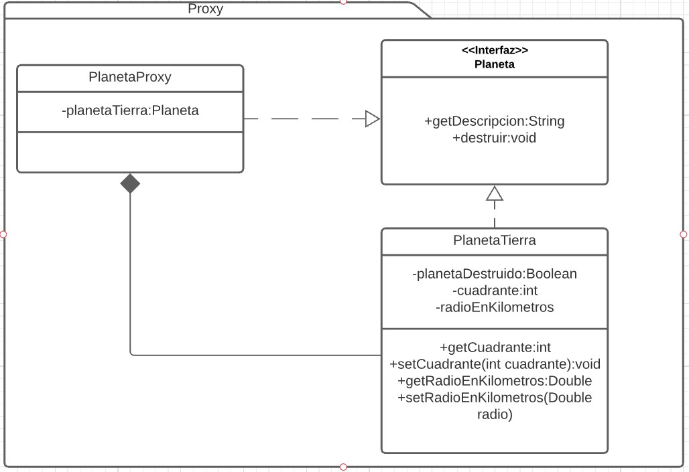

# Proxy
Es un patron estructural. [Link descripcion](https://sourcemaking.com/design_patterns/proxy)

Es un envoltorio sobre alguna clase compleja que sirve para mitigar la inicialización o agregar funcionalidad antes o después de sus metodos. Muy parecida a decorator pero generalmente inicializa una clase compleja conocida en lugar de recibir la interfaz como referencia. Es "dueño" de la implementación que proxea.

## Diagrama de clases

## SOLID
* Single responsibility

Un proxy tiene como responsabilidad esconder la complejidad del objeto "proxead" o "envuelto", no hay razón para incumplir este principio

* Open/Closed

Si la funcionalidad necesita cambiarse se puede crear un nuevo proxy con la funcionalidad cambiada y utilizar este en lugar del proxy original. Este principio se cumple

* Liskov substitution

Cualquier clase derivada del proxy debería actuar como si fuera el proxy padre en cualquier situación, esto se estaría cumpliendo

* Interface segregation

Si un proxy se encuentra siendo responsable de más de una funcionalidad del sistema, se debería separar en varias clases proxy más especificas para mantener una funcionalidad segregada en interfaces

* Dependency inversion

En este ejemplo de proxy no se esta aplicando la inversión de dependencias, aunque debería ser viable desacoplar la instanciación del objeto envuelto utilizando un patron de factory method o abstract factory por ejemplo.

